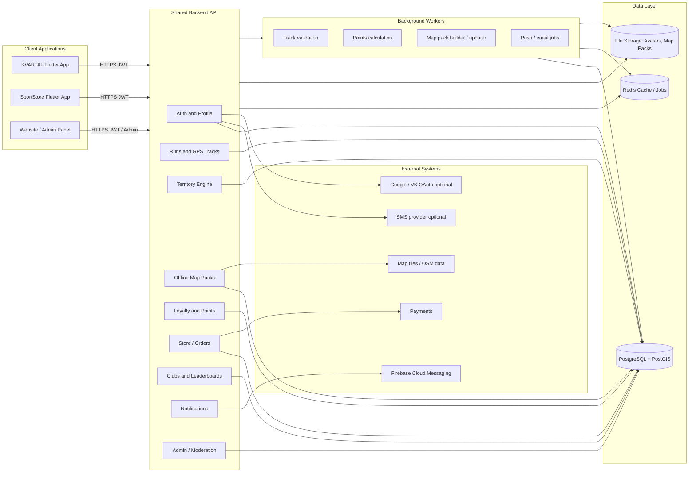
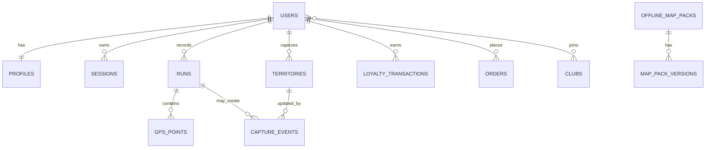

# KVARTAL Ecosystem Architecture

Date: 2026-06-10
Status: working project map for KVARTAL, SportStore, shared backend and future website.

## Product Goal

KVARTAL is the territory-capture running application. It should work as one part of a bigger ecosystem:

- KVARTAL mobile app: running, GPS tracking, territory capture, offline maps, clubs, ratings, achievements.
- SportStore mobile app: shop, loyalty, bonuses, purchases, user rewards.
- Website / admin panel: public pages, shop/admin tools, moderation, analytics, support.
- Shared backend: one account, one profile, one loyalty balance, shared API for all apps.

## High-Level Diagram

## Applications

| Application | Role | Main Responsibilities | Current Direction |
|---|---|---|---|
| KVARTAL | Running and territory game | GPS runs, route drawing, territory capture, offline maps, clubs, profile | Connect fully to shared backend, stabilize GPS/background tracking, improve capture geometry |
| SportStore | Store and loyalty app | Profile, purchases, points, catalog, rewards | Move profile and auth to the same backend account as KVARTAL |
| Website | Public site and admin | Brand site, admin, moderation, reports, support | Planned after backend contracts become stable |

## Backend Modules

| Module | Owns | API Examples | Notes |
|---|---|---|---|
| Auth | Login, JWT, sessions, linked providers | /v1/auth/phone/verify, /v1/auth/me | One user account across all apps |
| Profile | Name, phone, email, city, avatar | /v1/profile | Backend is source of truth |
| Runs | Raw tracks, distance, duration, pace | /v1/runs | Must accept background GPS points |
| Territory | Captured polygons, zone ownership, history | /v1/territories | Should use PostGIS for union/difference later |
| Offline Maps | Cities, districts, map packs, versions | /v1/maps/packs | First-launch flow and background downloads |
| Loyalty | Points, bonuses, achievements | /v1/loyalty | Shared with SportStore |
| Store | Catalog, orders, receipts | /v1/store | SportStore-first module |
| Clubs | Teams, ratings, events | /v1/clubs | Shared competitions and leaderboards |
| Notifications | Push, email, in-app messages | /v1/notifications | Firebase later |
| Admin | Moderation, analytics, support | /v1/admin | For website/admin panel |

## Core Data Model

## Key Rules

### Account

- One backend user account for KVARTAL, SportStore and website.
- Phone/email/Google/VK can be linked to the same user later.
- Mobile apps should not keep profile as local-only data.

### GPS And Runs

- Foreground and background tracking must send the same point format.
- Bad points should be filtered by accuracy, speed, time gap and impossible jumps.
- If the app was in background, the route must be restored from recorded points, not connected by one straight line.

### Territory Capture

- During a run, show the route.
- At finish, calculate whether owned territory actually expands.
- If the route is fully inside existing territory, finish as a normal run without capture prompt.
- If territory expands, add only the new area.
- Long-term: store owned territory as merged geometry, preferably in PostGIS.

### Offline Maps

- On first launch, ask the user to select a city/district pack.
- The user can continue without waiting for the full download.
- Downloads should continue in background where possible.
- Packs need version, size, status, update date and delete/update actions.

## Current Implementation Snapshot

| Area | Current State | Next Work |
|---|---|---|
| KVARTAL auth | Phone dev auth through backend, JWT cached | Add Google/VK later, harden token storage |
| KVARTAL profile | Backend-linked profile screen | Finish avatar upload and shared profile sync |
| Backend | FastAPI dev backend, SQLite for now | Move to PostgreSQL/PostGIS |
| SportStore | Has its own app profile logic | Connect to same auth/profile backend |
| Territory | Local capture logic exists | Prevent duplicate capture inside own territory, add geometry delta |
| GPS | Foreground works, background still needs hardening | Android foreground service + filters + persistence |
| Offline maps | First-launch city flow exists | Real pack download/update/delete architecture |

## Recommended Backend Evolution

1. Keep FastAPI as shared API while the product is moving fast.
2. Replace SQLite with PostgreSQL.
3. Add PostGIS for territories, polygons, intersections and unions.
4. Add Redis when background jobs and caching become necessary.
5. Add worker process for map updates, GPS validation, leaderboard recalculation and notifications.
6. Add admin panel once core data contracts are stable.

## Open Decisions

- Main login method: phone-first, email optional, Google/VK as linked providers later.
- Map source and offline pack format.
- Points formula: distance, territory expansion, streaks, store purchases.
- Territory precision: grid zones first or true polygon geometry with PostGIS.
- Admin stack: web frontend + backend admin routes, or separate admin framework.
